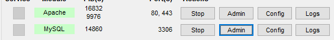
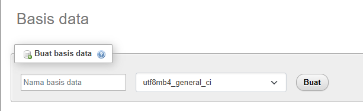
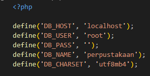
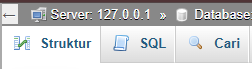
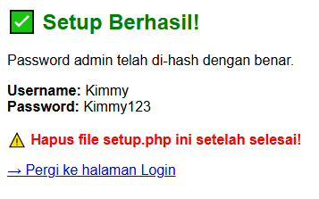
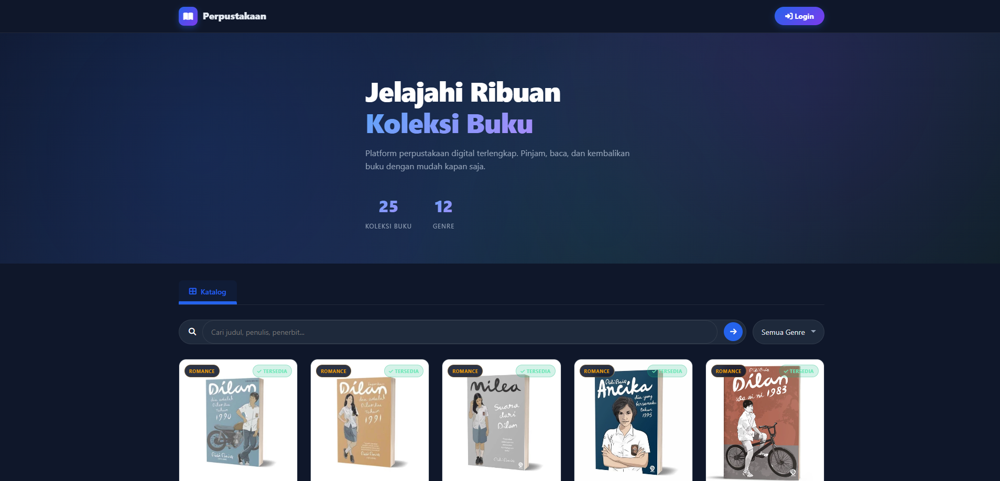

# CARA SETUP WEBSITE PREPUSTAKAAN DIGITAL

---

- Download <a href="https://www.apachefriends.org/download.html"> xampp </a> terlebih dahulu, setelah download install seperti biasa

- Jika sudah download dan install, download repository code ini lalu masukkan ke dalam folder htdocs:
    C:/xampp/htdocs/(masukkan folder code).

- Buka folder perpus di VS Code, lalu nyalakan xampp nya. Nyalakan bagian Apache dan MySQL.

- Buka folder config, disitu ada database.php, pada bagian DB_NAME samakan nama databasenya dengan yang nanti akan di buat.

- Masuk ke phpmyadmin dengan menekan tombol admin pada pada xampp MySQL.
    

- Nanti akan masuk kedalam website phpmyadmin, lalu pada website ini tekan +baru di bagian kiri web, lalu isi nama Database nya dan samakan dengan yang ada pada database.php lalu klik buat.
    
    
    note: kamu dapat mengubah nama databasenya sesuai keinginanmu

- Setelah database sudah terbuat pada phpmyadmin, pergi ke tab SQL, tombolnya berada di bagian atas, lalu pada bagian SQL tersebut paste semua code yang ada pada file perpustakaan.sql, setelah itu tekan kirim yang ada di bagian bawah.
    

- Database dan data sudah terisi semua, lalu sekarang tinggal menjalankan website nya.

```sh
# Cari ini pada browser yang kamu gunakan:

localhost/(nama-folder)/setup.php
```
Nanti akan muncul tampilan website yang isinya ada Username dan Password untuk admin, kamu bisa login dengan akun admin ini, atau bisa juga untuk membuat akun user biasa.

setelah muncul tampilan ini, kamu bisa langsung login dengan menekan "Pergi ke halamn Login"

- Untuk mengakses website utamanya kamu cari ini di browser

```sh
localhost/(nama-folder)/index.php
```


